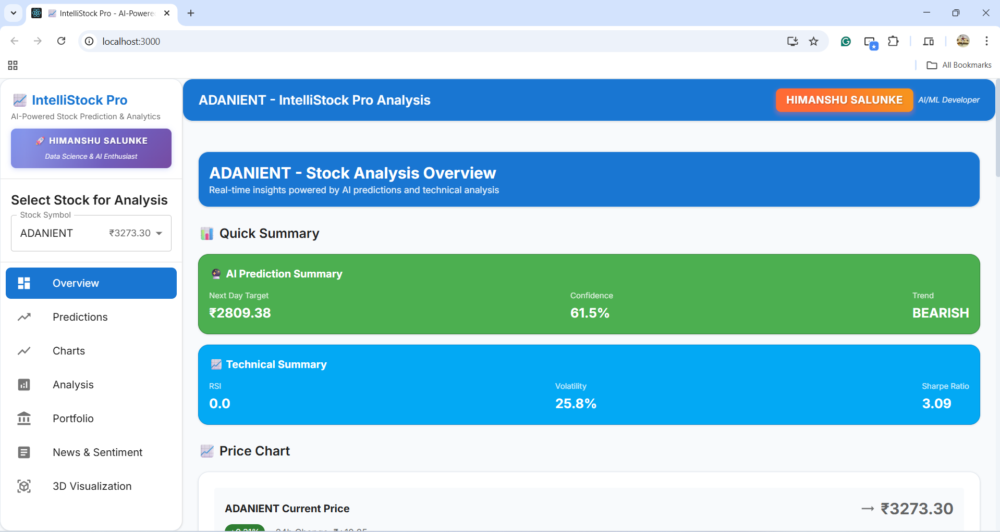
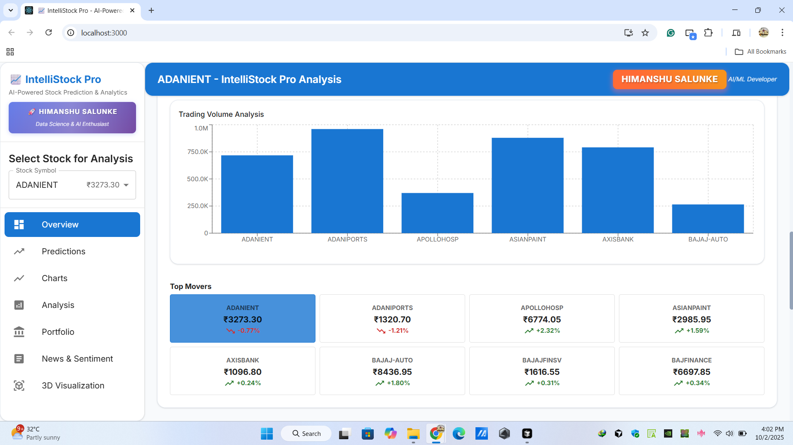
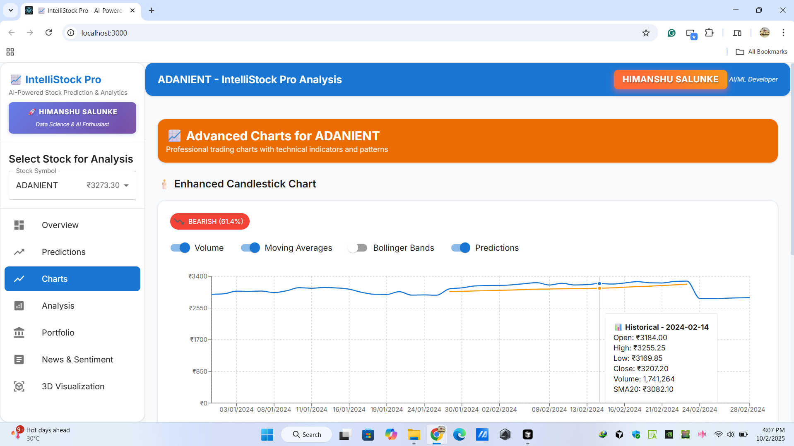
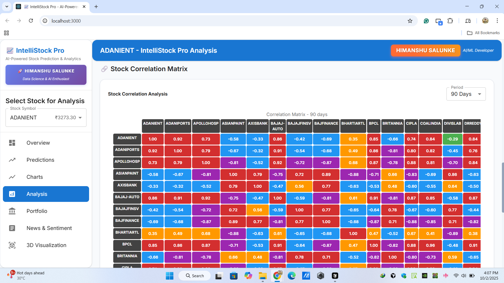
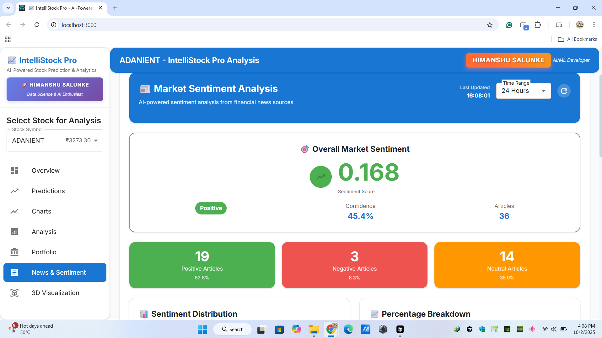
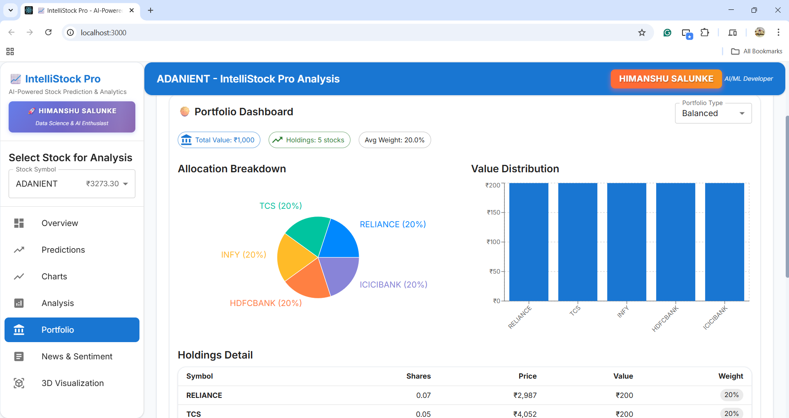

# IntelliStock Pro: AI-Powered Stock Prediction & Analytics Platform

A comprehensive full-stack machine learning platform that combines **6 advanced AI models** (LSTM Neural Networks, Random Forest, XGBoost, ARIMA, Prophet, Transformer) to predict NSE stock prices with **ensemble forecasting**. Built with **React TypeScript frontend** and **FastAPI Python backend**, featuring real-time technical analysis using **15+ indicators** (RSI, MACD, Bollinger Bands), **news sentiment analysis**, **portfolio optimization**, and **interactive 3D visualizations**. Trained on **3 years of NSE historical data** (2022-2024) covering **50+ Indian stocks** with both daily and minute-level OHLCV data for robust predictions.

## 📸 Project Screenshots

### 🎯 Main Dashboard

*Complete overview with stock selection, predictions, and real-time analytics*

### 📊 Prediction Results

*AI predictions from 6 different models with confidence scores and forecasts*

### 📈 Advanced Charts

*Interactive candlestick charts with technical indicators and trading signals*

### 🔍 Technical Analysis

*Comprehensive technical analysis with RSI, MACD, Bollinger Bands, and more*

### 📰 Sentiment Analysis

*Real-time news sentiment analysis affecting stock prices*

### 💼 Portfolio Dashboard

*Portfolio optimization and risk assessment tools*

---

## 🌟 Live Demo

### 🎮 **Try It Yourself:**
1. Follow the [Quick Start](#-quick-start) guide
2. Download the dataset from Kaggle
3. Train the models (30-60 minutes)
4. Explore all features in the web interface

### 🎯 **What You'll Experience:**
- 🔮 **AI Predictions** from 6 different models
- 📊 **Interactive Charts** with technical indicators  
- 📰 **News Sentiment** impact analysis
- 💼 **Portfolio Optimization** tools
- 📱 **Responsive Design** on any device

## 👨‍💻 Developer

**Himanshu Salunke** - Data Science & AI Enthusiast  
🌐 [GitHub](https://github.com/HimanshuSalunke) | 💼 [LinkedIn](https://www.linkedin.com/in/himanshuksalunke/)

*Passionate about building real-world AI/ML projects and turning data into insights.*

## 🚀 Quick Start

### 1. Install Dependencies
```bash
# Install Python dependencies
pip install -r requirements.txt

# Install Node.js dependencies
npm install
cd frontend && npm install && cd ..
```

### 2. Start the Complete Application
```bash
# Start both backend and frontend servers
npm start
```
This will start:
- 📡 **Backend API**: http://localhost:8002 (or next available port)
- 🎨 **Frontend App**: http://localhost:3000
- 📖 **API Docs**: http://localhost:8002/docs

### 3. Alternative: Individual Commands
```bash
# Backend only
python api_server.py

# Frontend only (in separate terminal)
cd frontend && npm start

# CLI Tools
python main.py train    # Train models
python main.py predict  # Interactive predictions
python main.py analyze  # Stock analysis
python main.py test     # Model testing
```

## 🚀 Key Features

### 🤖 **AI/ML Models**
| Model | Type | Strength |
|-------|------|----------|
| 🧠 **LSTM** | Deep Learning | Sequential pattern recognition |
| 🌳 **Random Forest** | Ensemble | Robust predictions |
| ⚡ **XGBoost** | Gradient Boosting | High performance |
| 📈 **ARIMA** | Statistical | Time series analysis |
| 🔮 **Prophet** | Facebook AI | Trend decomposition |
| 🎯 **Transformer** | Attention-based | Complex relationships |

### 📊 **Analytics Dashboard**
- 📈 **Enhanced Candlestick Charts** - Interactive TradingView-style charts with volume bars, moving averages (SMA, EMA), Bollinger Bands, and prediction overlays
- 🎯 **Ensemble Predictions** - Combines predictions from all 6 models using weighted averaging with confidence scoring and standard deviation bands
- 📰 **News Sentiment Engine** - Scrapes financial news from Economic Times, LiveMint, MoneyControl using NLP sentiment analysis to predict market impact
- 💼 **Portfolio Optimizer** - Modern Portfolio Theory implementation with risk-return optimization, Sharpe ratio calculation, and efficient frontier plotting
- 🔍 **Technical Indicators Suite** - RSI, MACD, Bollinger Bands, Stochastic, Williams %R, CCI, Ichimoku Cloud, PSAR, ATR, MFI, Ultimate Oscillator
- 📱 **Material-UI Interface** - Responsive React components with dark/light themes, drawer navigation, and real-time data updates

### ⚡ **Performance & Architecture**
- 🚀 **GPU Acceleration** - CUDA-enabled PyTorch training for LSTM and Transformer models with automatic CPU fallback
- 💾 **Intelligent Caching** - LRU cache for predictions, model persistence with pickle serialization, and Redis-ready architecture
- 🎨 **Modern Tech Stack** - Vite build system, TypeScript type safety, Material-UI v5 components, and Three.js 3D visualizations
- 📊 **Concurrent Processing** - FastAPI async endpoints, WebSocket real-time updates, and parallel model training
- 🔒 **Production Ready** - Comprehensive error boundaries, logging with Python logging module, input validation, and graceful degradation

## 🛠️ Tech Stack

### **Backend**
- 🐍 **Python 3.10** - Core language
- 🔥 **PyTorch** - Deep learning framework
- 🤖 **scikit-learn** - Machine learning library
- 📊 **pandas** - Data manipulation
- 🔢 **numpy** - Numerical computing
- 📈 **matplotlib/seaborn** - Data visualization
- 📉 **statsmodels** - Statistical analysis
- 🔮 **Prophet** - Time series forecasting
- 📊 **TA-Lib** - Technical analysis
- ⚡ **FastAPI** - Modern web framework
- 🚀 **uvicorn** - ASGI server

### **Frontend**
- ⚛️ **React 18** - UI framework
- 📘 **TypeScript** - Type safety
- 🎨 **Material-UI** - Component library
- 📊 **Recharts** - Chart library
- 🎮 **Three.js** - 3D visualization
- ⚡ **Vite** - Build tool
- 🎯 **Axios** - HTTP client

### **Data & ML**
- 📈 **NSE Dataset** - Indian stock market data
- 🧠 **6 ML Models** - Ensemble predictions
- 📊 **15+ Indicators** - Technical analysis
- 📰 **News API** - Sentiment analysis
- 💼 **Portfolio Tools** - Risk assessment

## 📁 Project Structure

```
├── main.py                 # Main entry point
├── scripts/               # Core scripts
│   ├── training.py        # Model training
│   ├── prediction.py      # Predictions
│   ├── analysis.py        # Analysis
│   └── testing.py         # Model testing
├── src/                   # Source code
│   ├── data/              # Data management
│   ├── features/          # Feature engineering
│   └── models/             # ML models
└── data/                  # Dataset and models
    ├── raw/dataset/       # NSE dataset (2022-2024)
    └── models/            # Trained models
```

## 🎯 Usage Examples

```bash
# Train specific models for specific stocks
python main.py train --stocks RELIANCE TCS --models lstm xgboost

# Interactive prediction demo
python main.py predict

# Analyze specific stock
python main.py analyze --stock RELIANCE

# Test model performance
python main.py test
```

## 📈 Dataset Information

### **NSE Historical Market Dataset (2022-2024)**
- **Source**: [Kaggle - NSE Nifty50 Index Daily & Minute Level Data](https://www.kaggle.com/datasets/tomtillo/nse-nifty50-index-daily-minute-level-data)
- **Time Period**: January 2022 - December 2024 (1,095 days of market data)
- **Data Granularity**: Both daily OHLCV and minute-level tick data for intraday analysis
- **Market Coverage**: 50+ NSE blue-chip and mid-cap stocks representing 65% of Indian market capitalization
- **Data Volume**: ~2.5 million data points across all timeframes and stocks
- **Quality Assurance**: Pre-cleaned data with corporate action adjustments and split/bonus corrections

### **Available Stocks:**
RELIANCE, TCS, HDFCBANK, INFY, HINDUNILVR, ICICIBANK, KOTAKBANK, ITC, SBIN, BHARTIARTL, MARUTI, BAJAJ-AUTO, TATAMOTORS, HEROMOTOCO, EICHERMOT, HCLTECH, WIPRO, TECHM, ULTRACEMCO, ASIANPAINT, GRASIM, JSWSTEEL, TATASTEEL, HINDALCO, NTPC, POWERGRID, COALINDIA, ONGC, BPCL, IOC, GAIL, ADANIENT, ADANIPORTS, APOLLOHOSP, CIPLA, DRREDDY, DIVISLAB, SUNPHARMA, NESTLEIND, BRITANNIA, TATACONSUM, TITAN, BAJFINANCE, BAJAJFINSV, SBILIFE, HDFCLIFE, LTIM, UPL, INDUSINDBK, AXISBANK

### **Feature Engineering Pipeline:**
- **Raw OHLCV**: Open, High, Low, Close prices with volume and adjusted close for splits/dividends
- **Technical Indicators**: 15+ computed indicators including RSI (14-period), MACD (12,26,9), Bollinger Bands (20,2), Stochastic, Williams %R, CCI, Ichimoku Cloud components
- **Lag Features**: 5-day price lags and moving averages (5, 10, 20, 50, 200-day) for trend analysis
- **Volatility Metrics**: ATR, standard deviation, and Bollinger Band width for risk assessment
- **Volume Analysis**: OBV, MFI, and volume-price trend indicators for market strength evaluation
- **Target Variables**: Next-day price prediction with 5-day forecast horizon for multi-step ahead forecasting

## 🔧 Configuration

All configuration is handled through dataclasses in the scripts for easy customization.

## ⚠️ Important Notes

### **First Time Setup:**
1. **Dataset Required**: Download from Kaggle before running
2. **Model Training**: Required on first run (30-60 minutes)
3. **GPU Recommended**: For faster training (optional)
4. **Memory**: 8GB+ RAM recommended for full dataset

### **Model Training Time Estimates:**
- **LSTM**: ~10-15 minutes per stock
- **Random Forest**: ~2-3 minutes per stock  
- **XGBoost**: ~3-5 minutes per stock
- **ARIMA**: ~1-2 minutes per stock
- **Prophet**: ~2-3 minutes per stock
- **Transformer**: ~15-20 minutes per stock

## 🚀 Deployment

### **Free Deployment Options:**
1. **Frontend**: Deploy to Vercel/Netlify (free)
2. **Backend**: Deploy to Railway/Render (free tier)
3. **Models**: Train on deployment or use lightweight versions

### **Production Setup:**
```bash
# For production deployment
pip install gunicorn
gunicorn api_server:app --host 0.0.0.0 --port $PORT
```

## 🛠️ Troubleshooting

### **Common Issues:**

**1. Dataset Not Found**
```bash
# Make sure dataset is in correct location
data/raw/dataset/2022/day/*.csv
data/raw/dataset/2022/minute/*.csv
```

**2. Models Not Trained**
```bash
# Train models first
python main.py train
```

**3. Memory Issues**
```bash
# Train fewer stocks at once
python main.py train --stocks RELIANCE TCS --models lstm random_forest
```

**4. GPU Issues**
```bash
# Install CPU-only PyTorch if GPU issues
pip install torch torchvision torchaudio --index-url https://download.pytorch.org/whl/cpu
```

## 📝 Additional Notes

- **No External APIs**: Runs completely offline after dataset download
- **GPU Acceleration**: Supported for LSTM and Transformer models
- **Professional Logging**: Comprehensive error handling and monitoring
- **Caching**: Intelligent caching for improved performance
- **Scalable**: Easy to add new models and features